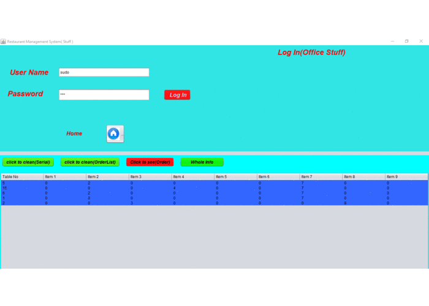

<!-- PROJECT LOGO -->
 

  

  <h3 align="center">Restaurant-Management-System-Java-Swing</h3>

<!-- ABOUT THE PROJECT-->
## About The Project

This is a GUI based project to manage a restaurant. It offers servies like puting order, see your order status, owner dashboard for delivering the order.

(<a href="#top">back to top</a>)

---
## Features: 
### Customer
  * Homepage
  * Order taking menu.
  * See Order Serial.
### Admin
  * Authentication for admin.
  * Admin Dashboard for delivering the order.
  * Delete orders
  * Clean all Orders. 
  * Show All order details. 
  

(<a href="#top">back to top</a>)

  
---
## Built With
* Java Swing.
* Java GUI.
* Neatbeans.

(<a href="#top">back to top</a>)

